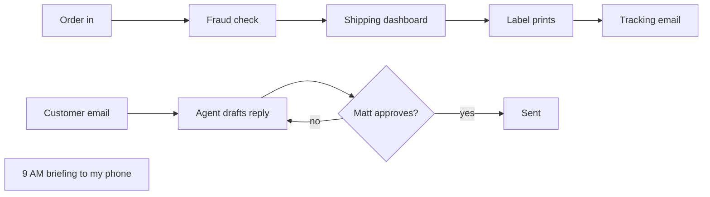
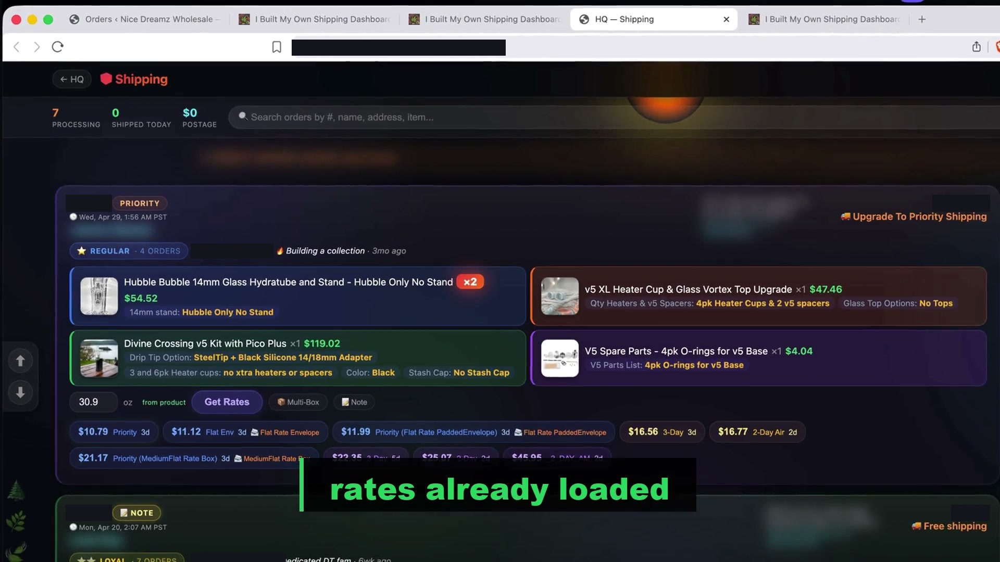

# How my one-person business runs

I sell vaporizers from Humboldt County, California. The retail side is Divine Tribe at ineedhemp.com. The wholesale side is Nice Dreamz. Nice Dreamz has operated out of Humboldt County since 2013, with no investors.

This page explains how I run all of it mostly alone, with AI agents doing the admin.

## The problem

Work slowed down, and over 2025 and into early 2026 I let my last two employees go. The orders, the emails, the shipping and the customer questions did not slow down with it. I found I could do all of it myself if AI handled the typing and the clicking. I don't think the business would have survived otherwise.

So now it's me and a set of agents. The agents do the legwork. I make the calls.

## The loop

Orders come in on three WooCommerce stores: ineedhemp.com, nicedreamzwholesale.com and tribeseedbank.com. Here is what happens to each one.

**Fraud check.** A plugin on the store holds any order that matches a shared blocklist of names, addresses, emails and phones. There is one list, kept in one file, and every machine reads the same copy. The dashboard also flags orders where the billing and shipping names don't match. Customers with a good history get a pass on that one, so a gift order doesn't get stopped.

**Shipping.** This is the part I'm proudest of. I call it Cinch. It puts every open order from all three stores on one screen with carrier rates already loaded. I click a rate, the label prints on my thermal printer, and the order closes itself. In a good run that's four seconds per order. Clicking into every order in the WordPress admin used to take me a minute and a half.

The old way, for comparison:

If the same customer orders twice to the same address, the two orders merge into one card and one label. Multi-box orders get a rate per box. At the end of the day one button makes the USPS scan form. The front end is one page of plain HTML and JavaScript. The back end is a small Flask app that talks to WooCommerce and EasyPost.

**Tracking.** The customer gets one email with the tracking number in it, sent through the dashboard. I only send a text if the customer started the conversation by text.

**Support.** Agents read the whole email thread, pull the customer's order history from the store, and draft a reply in my voice, which is short and plain. It goes in the existing thread. For a warranty problem the first reply only asks questions. It never offers a replacement up front. I read the draft and say send, or I change it.

**The morning briefing.** At 9 AM my phone gets a text with the day's orders and an email summary, so I know what's waiting before I sit down.

## Where the AI runs

Ohm is the chief of staff inside the dashboard. It sends each job to the cheapest model that can do it, and the lowest tier is a local model.

I keep a clear line on what goes local. Local models handle the mechanical work: summaries, triage, briefings and classification. Customer email and anything that drives tools stay on the best cloud model, because a bad sentence costs me a customer and a fumbled tool call costs real money. I tested this. A 9B local model I tried for sorting email got 75.5% right and called real customers junk. So email stays where it is.

When Claude is down or I hit a usage limit, the headless agents switch to a local model and keep running. That is what claude-failover does.

## The machines

- **Mac mini.** Always on. It runs the morning briefing, sends the iMessages, runs the watchers and hosts the browser broker. It is the machine that sends texts and media to my phone.
- **My laptop.** A Mac with 128GB of memory. This is where I work and where I run local models.
- **A Windows PC.** I use it when I need it. It is only reachable when it's awake.
- **A small VPS.** It hosts the shipping dashboard, Ohm and the job queue.
- **Store hosting.** The three WordPress and WooCommerce sites live here.

## How the agents reach each other

- **A shared brain.** One private git repo holds the memory every agent reads. Each machine pulls when a session starts and pushes when it ends, so a lesson learned on one machine is known on all of them. Nothing gets deleted by a sync, and on a real conflict the newest note wins. Each machine also writes a daily log, and the machines leave each other notes in a messages folder.
- **A lessons file.** Every mistake that cost me something becomes a one line rule that all agents load.
- **A job queue.** The dashboard has a queue the mini polls. If I'm on the PC and need something run on the mini, I queue it and read the result back.
- **One window for every session.** Moonstone shows every Claude Code session on every machine in one list. I can answer by voice.
- **One tab for every machine.** FiaOS puts each machine's screen and terminal behind one browser tab.
- **My phone.** claude-screen-to-phone lets me text a command to a session from my iPhone and get text, images and video back over iMessage.
- **One shared browser.** The agents all need my logged-in browser. browser-broker gives each agent its own tab and keeps them out of each other's and out of mine.
- **Agents as customers.** x402-php lets an AI agent pay the store over HTTP. The store's plugins can list a catalog for agents and charge AI crawlers, and they start in a watch-only mode.

## The rule that runs through all of it

Agents draft. I approve anything that goes outside the building.

That means emails, texts, posts, invoices and any order change the customer would see. I started this in April 2026, after an agent got my unread email count badly wrong (201 against 15). I told it to draft first and show me, so I could trust it again. It has stayed.

A few details make it hold up. An email only goes out when I literally say send. If we change the plan partway through, say the shipping method or the price, the old approval is dead and I get the draft again. A hook on my machine blocks any customer email that promises money or product until I've approved that exact text. Anything that costs money gets its own line in the draft, so I can't miss it.

## The public parts

The shared brain and the dashboard are private, because they hold customer data. The tools underneath them are public and MIT or Apache licensed.

- [moonstone](https://github.com/nicedreamzapp/moonstone), a voice control panel for every Claude Code session on every machine
- [browser-broker](https://github.com/nicedreamzapp/browser-broker), many agents sharing one real logged-in browser
- [claude-screen-to-phone](https://github.com/nicedreamzapp/claude-screen-to-phone), run a session from an iPhone over iMessage
- [FiaOS](https://github.com/nicedreamzapp/FiaOS), every machine in one browser tab
- [x402-php](https://github.com/nicedreamzapp/x402-php), lets AI agents pay a store
- [claude-failover](https://github.com/nicedreamzapp/claude-failover), agents keep running on a local model when Claude is down
- [My profile](https://github.com/nicedreamzapp/nicedreamzapp), where the rest of my local AI work lives

I'm open to work building local and on-device AI. This is what one person built to keep a shop running.
